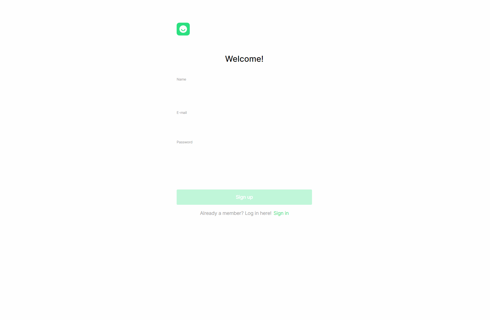

# FINAL VERSION OF MOVIES EXPLORER

## Have a look at the project

<https://movies.explorer.project.nomoredomains.sbs/>

Public IP of the server: `51.250.96.109`

## Description

The repository that unites the frontend and backend parts of the Movies Explorer student project - a web application for sharing photos with the functionality of user registration and authentication.

The application was deployed on the remote server and the domain name was assigned to it.

## Links

[See readme of here to learn about the frontend functionality of the project](https://github.com/artemshchirov/react-movies-explorer-api-full/tree/main/frontend)

[Project backend](https://github.com/artemshchirov/react-movies-explorer-api-full/tree/main/backend)

## Demo Functionality

### Localization

### Adaptive

### Search

### Save / remove favorite movies

### Filter short movies

### Show more

### Edit user info

### Access control

### Form validation

